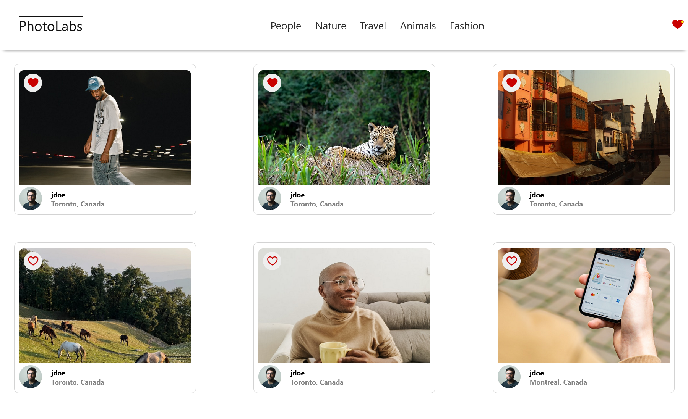
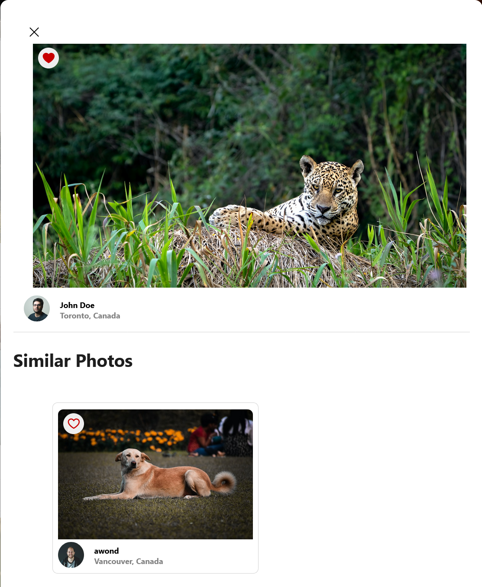
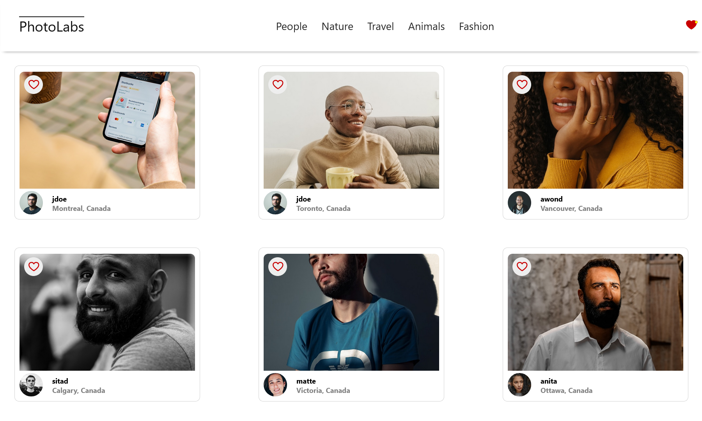
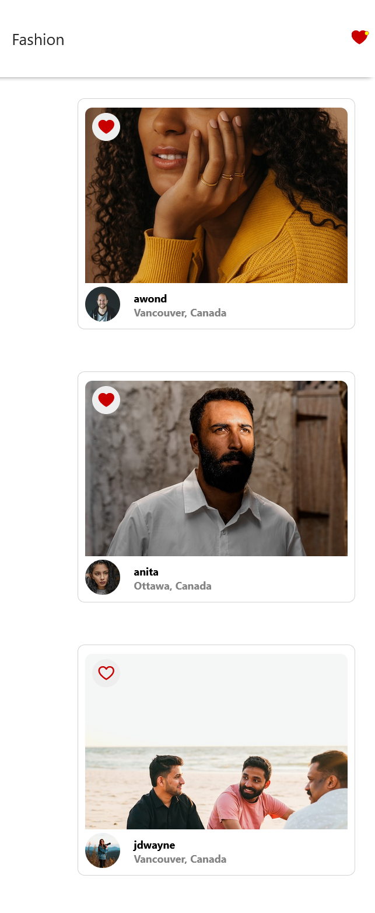

# PhotoLabs
Photolabs is a photo-sharing platform, where you can like and filter photos based on certain topics!

## Features
- Liking photos
- Seeing liked photo notification
- Interacting with photos to see the full image/similar images
- Filtering photos based on Topics in the Navigation Bar
- Gathering Inspiration

## Stack
- React
- JSX
- Babel
- Webpack
- Express
- SCSS

## Setup
1. Clone the repository: ` git@github.com:nicoayamen/photolabs.git `
2. Install dependencies with `npm install` in each respective `/frontend` and `/backend`.

## Get Started
Follow the steps below to start PhotoLabs!

## [Frontend] Running Webpack Development Server

```sh
cd frontend
npm start
```

## [Backend] Running Backend Servier

Read `backend/readme` for further setup details.

```sh
cd backend
npm start
```

## Final Product





## Special Thanks
A huge thank you to the mentors who helped me, and to Charley and Kim for assisting me in props hell!